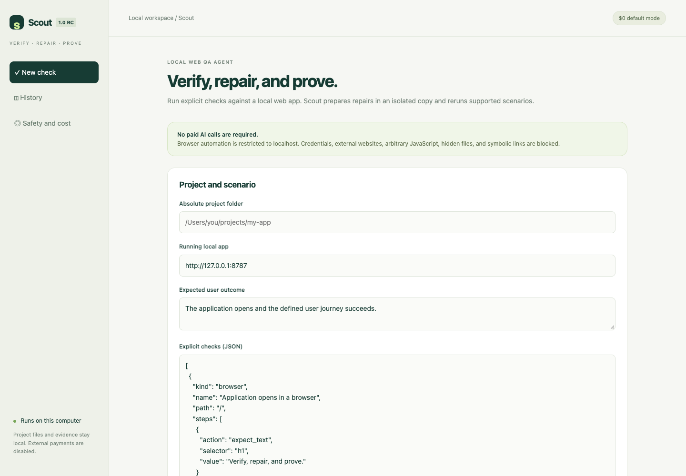

# Scout

> Local QA that turns a bug report into a repeatable check and a verified repair candidate.

Scout is a product I am currently building. It helps small teams reproduce broken web flows, keep the evidence, and review a narrowly scoped repair without giving an agent unlimited access to the project.

- **Status:** active development
- **Product:** private local application
- **Repository:** public product showcase, no source code

## The problem

A bug report, the observed failure, the attempted fix, and the final verification often live in different places. By the time a developer opens the issue, important context is already missing.

Scout keeps that path together.

## How it works

**Define → run → inspect → prepare candidate → rerun**

1. Select a local project and describe the expected result.
2. Add explicit browser, HTTP, or file checks.
3. Run the scenario and preserve the failure evidence.
4. Prepare one bounded repair in an isolated copy.
5. Run the same scenario again and compare the result.

## Product surface

The interface keeps four things visible at the same time:

- the user outcome being tested;
- the checks that define success;
- the evidence collected during the run;
- the exact authority Scout has for the next action.

The goal is not to make the agent feel autonomous. The goal is to make the work understandable.

## Safety boundaries

| Boundary | What it means |
| --- | --- |
| Localhost only | Browser checks stay inside the local development environment. |
| Original stays untouched | Repairs are prepared in an isolated candidate copy. |
| One bounded change | Broad or ambiguous edits are rejected. |
| Evidence before success | A repair counts only after the original scenario passes. |
| Visible approval | The user decides whether a candidate moves any further. |
| Local by default | Project data and evidence are not silently uploaded. |

## Why the UI is quiet

QA tools tend to surface every log at once. Scout starts with the decision the user needs to make: did the workflow fail, what evidence supports that result, and is a repair candidate safe to review?

Technical detail remains available, but it does not compete with the current state or next action.

## What works today

- repeatable browser, HTTP, and file checks;
- saved run history and evidence;
- isolated repair candidates;
- before-and-after verification;
- local inference support;
- explicit limits around repair scope and model usage.

Scout has also been tested against an independent TodoMVC-style application: it detected a broken Enter-key flow, prepared an isolated correction, and passed the same browser scenario after the change.

## Next

- clearer comparison between failed and repaired runs;
- reusable check templates;
- review links for teams;
- CI-triggered verification;
- shared policies and approval roles.

## Public scope

This repository contains the real product screenshot and a description of the workflow, interface, and product boundaries.

The application source, repair engine, private test data, production configuration, and credentials remain private.

---

Built by [0xENTYPER](https://github.com/0xENTYPER).
