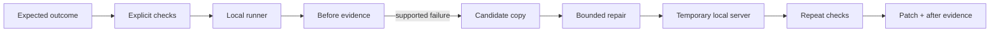

# Scout Agent

> Verify, repair, and prove local web-app behavior with bounded AI authority.


Scout turns a vague bug report into a repeatable local workflow: define explicit checks, collect technical evidence, prepare a supported repair in an isolated candidate copy, and rerun the same scenario. It is designed around a simple rule: an AI repair is not useful until the product can show exactly what was observed, changed, and proved.

This repository documents the product and architecture. The complete local application and production controls remain private.

## Product problem

Small teams frequently lose the connection between a report, the observed failure, the attempted change, and the final verification. General-purpose coding agents can make that worse by changing too much or acting with unclear authority.

Scout narrows the operation:

```text
one local project
+ one declared user outcome
+ explicit checks
+ one bounded candidate repair
+ the same checks again
= reviewable evidence
```

## Execution model



Supported browser actions deliberately use a small grammar:

```json
{
  "kind": "browser",
  "name": "Creating a task works",
  "path": "/",
  "steps": [
    { "action": "fill", "selector": "#new-task", "value": "Ship evidence" },
    { "action": "press", "selector": "#new-task", "value": "Enter" },
    { "action": "expect_text", "selector": "main", "value": "Ship evidence" }
  ]
}
```

## Safety is part of the product

| Boundary | Product behavior |
| --- | --- |
| Localhost only | Browser automation accepts only `127.0.0.1` and `localhost`. |
| Original stays untouched | A repair is written into an isolated candidate copy. |
| Hash before change | The observed source must still match before a replacement is prepared. |
| One unique replacement | Ambiguous or broad text edits are rejected. |
| Public files only | Hidden paths, symbolic links, credential-like files, and sensitive selectors are blocked. |
| Repeat verification | The same scenario runs against the candidate before success is shown. |
| No hidden spend | Planning is free and optional inference has visible local limits. |
| No silent upload | Evidence and support bundles stay local unless the user explicitly shares them. |

## Architecture

```text
local workspace UI
    | scenario and policy
application service
    | SQLite state + operation lock
check runner
    | browser / HTTP / file adapters
candidate repair pipeline
    | copy -> validate -> replace -> serve -> retest
evidence and report store
```

The application is intentionally dependency-light:

- Python owns the local service, storage, runner, and evidence lifecycle.
- Playwright handles the bounded browser-action grammar.
- SQLite records runs, policies, budgets, and repeatable state.
- Optional Ollama keeps inference local.
- Optional user-funded inference is constrained by per-call and monthly limits.

## Repair contract

The AI does not receive authority to edit arbitrary code. It proposes one small replacement:

```ts
type RepairProposal = {
  file: string;
  find: string;
  replace: string;
  explanation: string;
  applied: false;
};
```

The product then verifies path policy, source hash, target uniqueness, size, sensitivity, candidate-copy limits, and repeat-test behavior. This public type mirrors the production boundary without exposing the repair engine.

## Evidence lifecycle

Each run can preserve:

- scenario definition;
- timestamps and runner status;
- before and after assertions;
- browser screenshots;
- HTTP responses and selected JSON evidence;
- candidate path and patch;
- the exact failure that allowed repair preparation;
- the final rerun result.

A support bundle is intentionally smaller: it excludes source files, screenshots, prompts, credentials, keys, and absolute paths.

## Verification

The private product test suite covers:

- browser and file runner behavior;
- application policy and operation locking;
- candidate-copy and replacement controls;
- budget and reserve behavior;
- treasury decisions;
- report and support-bundle redaction.

The system has been exercised against an independent TodoMVC-style project: it detected a broken Enter-key flow, prepared an isolated exact replacement, started the candidate on a temporary port, and passed the original browser scenario after repair.

## SaaS direction

The strongest hosted version is not an autonomous code editor. It is a team verification product:

- shared run history;
- CI-triggered scenarios;
- policy templates;
- reviewable candidate patches;
- organization-level evidence retention;
- metered private inference;
- explicit approval before a repair reaches a repository.

## Public scope

Included here:

- real working-product screenshot;
- system workflow and architecture;
- safety model;
- representative public contracts;
- product and SaaS direction.

Not included:

- complete local application source;
- repair implementation;
- production configuration;
- private test fixtures or run data;
- credentials and inference keys.

---

Built by [0xENTYPER](https://github.com/0xENTYPER).
